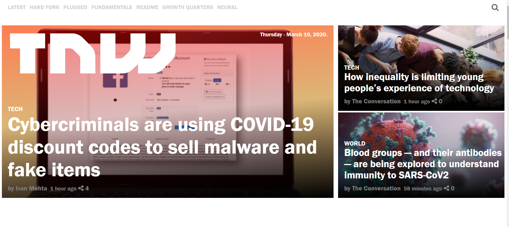

# New York Times - Clone

This is a clone application of The Next Web homepage.
 
 
 
 

In this project, our aim here wasn’t to produce an exact replica of The Next Web homepage, but rather to focus on how to use media queries for responsiveness CSS.

There are many elements on The Next Web homepage which are produced with Javascript but our objective in this project wasn't to give this page functionality.

## Built with
  * HTML 
  * CSS (Box Model, Float, Grid, Media Queries Flex and Positioning)
  * Lint (Stickler)
  * W3C Validator

## Live demo
https://rawcdn.githack.com/teekaytech/tnw-clone/eaab237d27ca933852320b99482e277a821cfeb5/index.html

## Getting started
**For this project, we tried our best to recreate The Next Web homepage. The main aim is to ensure responsiveness when the page is viewed on tablets and mobile phones using media queries, so functionality is not a priority.**

We used the browser’s developer tools to inspect the real New York Times page to understand how elements are placed and styled.
We built our own page in a .html text file and opened it in our browser to check it out. We carried out the following steps:
  - First setup a github repository for the project.
  - Then create a .html file where all our HTML markup will go
  - Create a .css file where all our styling code will reside
  - Then open the New York Times web page on https://thenextweb.com/, inspect its features with your browser's developer tools and start creating  :shipit:

## Authors
 :bust_in_silhouette: **Author 1**
 * Github: https://github.com/teekaytech/
 * Twitter: https://twitter.com/ola_lere
 * LinkedIn: https://www.linkedin.com/in/teekaytech/
 
 :bust_in_silhouette: **Author 2**
 * Github: https://github.com/NiiazalyDzhumaliev/
 * Twitter: https://twitter.com/Niiazaly1
 * LinkedIn: /https://www.linkedin.com/in/niiazaly-dzhumaliev-117707132/

## Contributing
Contributions, issues and feature requests are welcome!

   1. Fork the Project
   2. Create your Feature Branch (git checkout -b feature/AmazingFeature)
   3. Commit your Changes (git commit -m 'Add some AmazingFeature')
   4. Push to the Branch (git push origin feature/AmazingFeature)
   5. Open a Pull Request

Feel free to check the [issues page](https://github.com/teekaytech/tnw-clone/issues).

## Show your support
Give a :star: if you like this project!

## Acknowledgements
  * [Microverse](https://www.microverse.org/)
  * [The Odin Project](https://www.theodinproject.com/courses/html5-and-css3/lessons/embedding-images-and-video#introduction)

## License
 Distributed under the MIT License.
